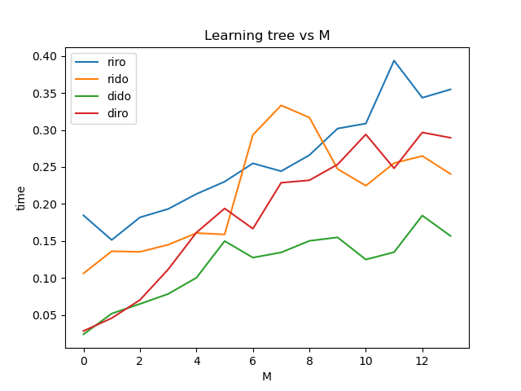
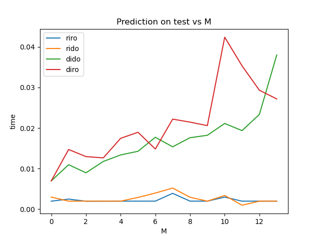
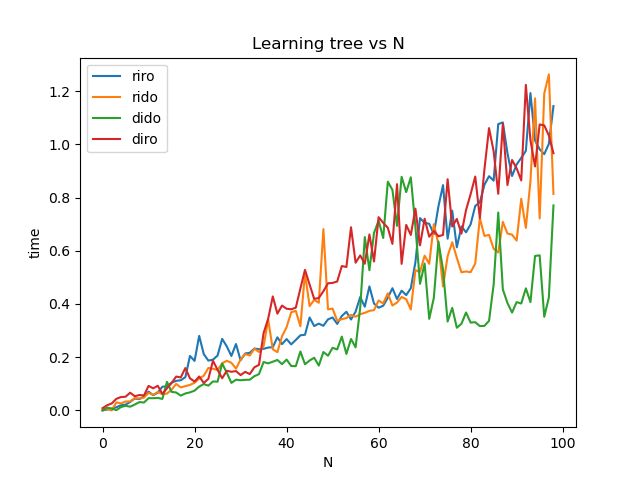

##### Learning by varying M

  

##### Prediction by varying M

  

1. Theoretical train time complexity of O(M) when number of examples is kept constant.
2. In the learning graph shown above, the time taken increases with M but not linearly.
3. Prediction Graph
 
##### Learning tree by varying N

  

##### Prediction by varying N

  

1. Theoretical train time complexity of O( N * logN ) when number of attributes is kept constant.
2. In the learning graph shown above, the time taken increases with N.
3. Prediction Graph